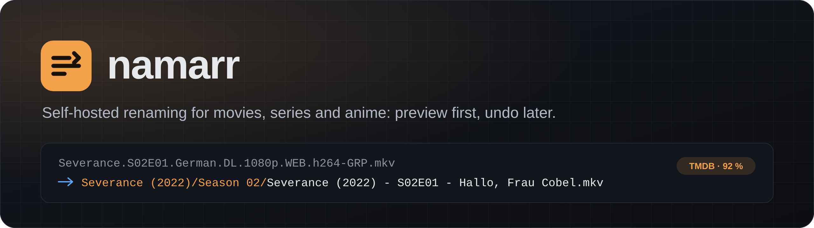
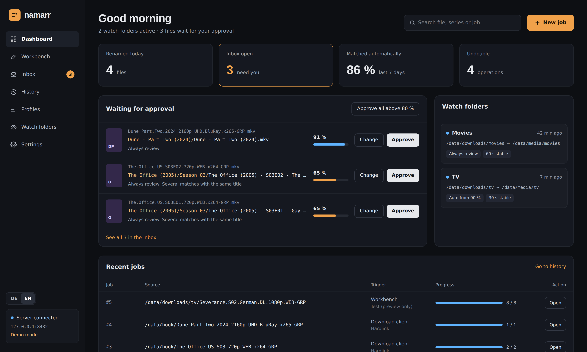

<h1 align="center">namarr</h1>

<div align="center">



**The self-hosted renamer for movies, series and anime: a FileBot alternative for your home server.**<br>
FileBot-style media matching and ReNamer-style rules in one web UI, in a Docker container.
Every change starts as a preview, and every change can be undone.

[](https://github.com/firsttris/namarr/actions/workflows/ci.yml)
[](https://hub.docker.com/r/tristanteu/namarr)
[](https://hub.docker.com/r/tristanteu/namarr)
[](https://hub.docker.com/r/tristanteu/namarr/tags)
[](https://bun.sh/)
[](https://firsttris.github.io/namarr/)
[](https://www.typescriptlang.org/)

[Features](#-features) •
[Metadata](#-metadata-sources) •
[Quick start](#-quick-start) •
[Documentation](https://firsttris.github.io/namarr/) •
[Contributing](#-contributing)


</div>

## 💡 How it works

1. **Point it at a folder**: downloads, an old collection, photos or music.
2. **Check the preview**: namarr matches every file against TMDB, TheTVDB, TVmaze or AniDB (or
   applies your rules) and shows old → new. Nothing moves yet.
3. **Rename**, and undo it any time, per file or per job.

One container for your home server: FileBot-style matching for movies, series and anime,
ReNamer-style rules for everything else. Names come out in the format Plex, Jellyfin, Emby or Kodi
expect, or in your own.

## ✨ Features

| | |
|---|---|
| 🎬 **Movies, series, anime** | Matching against TMDB, TheTVDB, TVmaze and AniDB · IDs in folder names (`{tmdb-1399}`, `[tvdbid-72073]`) · ffprobe for names without resolution or codec |
| ✏️ **Rules for everything else** | 16 ReNamer-style rules (replace, regex, numbering, clean up …) · photos by EXIF date · music by tags · rule sets as YAML |
| 🧩 **Naming formats** | Template language with live example · built in: Plex, Jellyfin, Emby, Kodi · own formats per kind · **detect the format of your existing library** |
| 🔍 **Preview & undo** | Test mode by default · diff view, keyboard control · conflicts incl. *keep better* (resolution, HDR, codecs, audio) · undo per file, job or point in time |
| 🤖 **Automation** | Watch folders that wait for finished downloads · inbox for uncertain matches · hook for qBittorrent, SABnzbd, NZBGet |
| 📚 **Libraries** | One default folder each for movies and series · move, copy or rename in place · folder browser for every path |
| 🔔 **After a job** | Library refresh for Jellyfin, Emby, Plex · notifications via ntfy, Gotify, Telegram, Discord, webhook |
| 🌍 **UI** | English and German, including every server message |

## 🗂️ Metadata sources

| Source | Movies | Series | Anime | Access |
|---|:---:|:---:|:---:|---|
| **TMDB** | ✅ | ✅ | ✅ | your own API key |
| **TheTVDB** | ✅ | ✅ | ✅ | API key, plus PIN for a user-supported key |
| **TVmaze** | | ✅ | | none, free |
| **AniDB** | | | ✅ | registered client |

Series and movies can come from different sources, and every watch folder can pick its own series
source, for example AniDB for an anime folder. Details: [docs/metadata.md](docs/metadata.md).

## 🐳 Quick start

```bash
mkdir namarr && cd namarr
curl -o compose.yml https://raw.githubusercontent.com/firsttris/namarr/main/docker/compose.example.yml
# set NAMARR_TOKEN and your media mount, then
docker compose up -d
```

Open **http://localhost:8420**, sign in with your token, then under *Settings* add your
[folders](docs/installation.md#folders-and-libraries) (`/data`, or your download, movie and series
mounts) and a TMDB API key, or set up one of the [other sources](docs/metadata.md).

<details>
<summary><b>docker run</b></summary>

```bash
docker run -d --name namarr --restart unless-stopped \
  -p 8420:8420 \
  -e PUID=1000 -e PGID=1000 \
  -e NAMARR_TOKEN="$(openssl rand -hex 24)" \
  -v ./config:/config \
  -v /mnt/data:/data \
  tristanteu/namarr:latest
```

</details>

<details>
<summary><b>Podman Quadlet</b></summary>

```bash
mkdir -p ~/.config/containers/systemd ~/namarr/config
curl -o ~/.config/containers/systemd/namarr.container https://raw.githubusercontent.com/firsttris/namarr/main/docker/quadlet/namarr.container
# adjust /mnt/data in namarr.container, then
printf 'a-long-token' | podman secret create namarr-token -
systemctl --user daemon-reload && systemctl --user start namarr
```

</details>

<details>
<summary><b>Unraid</b></summary>

Use the template in [`docker/unraid/namarr.xml`](docker/unraid/namarr.xml).

</details>

| Volume | Content |
|---|---|
| `/config` | SQLite database |
| `/data` | your downloads and your library (or one mount each, see the installation guide) |

Environment variables, image tags, updates and the API are in the
[installation guide](docs/installation.md).

## 📸 Screenshots

<div align="center">

</div>

## 📚 Documentation

The full documentation is a website with search: **[firsttris.github.io/namarr](https://firsttris.github.io/namarr/)**.
The same pages are in [`docs/`](docs/README.md) here on GitHub.

| | |
|---|---|
| [Installation](https://firsttris.github.io/namarr/installation.html) | Compose, docker run, Quadlet, Unraid, folders, environment variables, image tags, updates and backup, health and events |
| [Workbench](https://firsttris.github.io/namarr/workbench.html) | preview, actions, conflicts and *keep better*, undo, template language, naming formats and detecting them from a library, rules |
| [Automation](https://firsttris.github.io/namarr/automation.html) | watch folders, inbox, download client hook, library refresh, notifications |
| [Metadata sources](https://firsttris.github.io/namarr/metadata.html) | TMDB, TheTVDB, TVmaze, AniDB, IDs in folder names, languages, episode order |
| [Development](https://firsttris.github.io/namarr/development.html) | setup, checks, architecture, tests, parser corpus, roadmap |

## 🛠️ Development

Requires [Bun](https://bun.sh/) 1.4.

```bash
git clone https://github.com/firsttris/namarr
cd namarr
bun install
NAMARR_DEMO=1 bun run dev   # http://localhost:8420 with an offline demo catalog
```

**Stack**: Bun, TanStack Start (React, server functions), TanStack Query and Virtual, Tailwind,
SQLite with Drizzle, Vitest and Playwright. More in [docs/development.md](docs/development.md).

## 🤝 Contributing

A release name that namarr parses wrong is the most useful issue there is: add it to
`packages/core/test/corpus/releases.yaml` or paste it into an issue. Pull requests are welcome; please
run `bun run lint`, `bun run typecheck` and `bun run test` before opening one.

---

<div align="center">
<sub>namarr is not affiliated with TMDB, TheTVDB, TVmaze or AniDB.
This product uses the TMDB API but is not endorsed or certified by TMDB.</sub>
</div>
