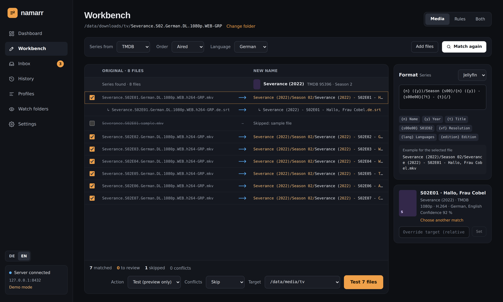

# Workbench

The workbench (`/rename`) is where you rename by hand: pick a folder on the server, check the
preview, fix what is wrong, run it, and undo it if you change your mind.



## The preview

1. **Pick a folder** on the server (inside the allowed root paths) and a **mode**:
   - *Media*: match against a [metadata source](metadata.md) and name by template
   - *Rules*: rename with a rule stack, no database involved
   - *Both*: match first, then polish the result with rules
2. Optionally pick a **profile**: template, rules, action, conflict policy, target and series source
   in one.
3. The **virtualized preview** shows old → new with diff highlighting, series groups, companion files
   (`↳ .de.srt`), confidence badges and skipped samples.

Keyboard: ↑ ↓ select, space includes or excludes a file, Enter opens the **match picker** to choose
another series or movie. A choice can be remembered, so the same release name always lands on the
same entry.

On the right:

- the **template editor** with token auto-completion (type `{`) and a live example for the selected
  file
- the **rule stack** with drag and drop and a preview per rule

At the bottom: action, conflict policy, target and the button that runs the job.

## Actions

| Action | What happens |
|---|---|
| Test (preview only) | nothing; conflicts are marked. **New jobs start here.** |
| Move | moves the file (across file systems: copy, check size, delete) |
| Copy | copies and checks the size |
| Hardlink | a second name for the same data; the download keeps seeding. Source and target must be on the same file system |
| Symlink | an absolute symbolic link to the source |
| Rename | renames in place |

Every operation lands in the **history** and can be undone per file, per job or back to a point in
time, but only while the target file is unchanged since. Folders that namarr created are removed
again when they are empty.

## Conflicts

When the target already exists:

| Policy | Behaviour |
|---|---|
| Skip | leaves both files alone (default) |
| Overwrite | moves the existing file aside as a backup, restored on undo |
| Suffix | `Name (1).mkv`, `Name (2).mkv`, … |
| Keep better | replaces the existing file only when the new one is better |

**Keep better** compares one criterion after another, and the first one where the two files differ
decides:

1. resolution
2. source: Remux > BluRay > WEB-DL > WEBRip > HDTV > DVD
3. HDR: DV / HDR10+ > HDR10 / HLG > SDR
4. video codec: AV1 > H.265 > H.264
5. audio: codec, then channels
6. PROPER / REPACK
7. only then file size

So a 4K HEVC beats a bigger 1080p H.264. The facts come from the file name and, when installed, from
ffprobe (resolution, codec, HDR, best audio track). For the existing file namarr uses the release name
it had before namarr renamed it, otherwise it would know nothing about its source. A criterion only
one side knows does not count. The reason is shown on the item ("Existing file is better (Source: WEB
vs BluRay)"); a replaced file is kept as a backup and restored on undo, and its subtitles are replaced
with it.

## Template language

```
{n} ({y})/Season {s00}/{n} ({y}) - {s00e00}{?t} - {t}{/}
{t|lower}   {n|replace:':':' -'}   {vf|default:'SD'}   {n|ascii}   {e|pad:3}
{?edition} [{edition}]{/}   {!t}Episode {e}{/}   \{edition-{edition}\}  (Plex)
```

**Tokens**: `n` name, `y` year, `s`/`e`, `s00`, `e00`, `s00e00` (double episodes: `S02E04-E05`),
`sxe`, `t` episode title, `absolute`, `d` date, `vf` resolution, `vc` video codec, `ac`/`af` audio,
`hdr`, `source`, `group`, `lang`, `edition`, `part`, `id`, `provider`, `orig`, `ext`.

**Filters**: `lower upper title trim replace default pad truncate ascii space first`.

**Conditions**: `{?t}…{/}` only when `t` is set, `{!t}…{/}` only when it is not.

**Presets**: Plex, Jellyfin, Emby, Kodi.

Every path segment is cleaned for the target system: characters Windows forbids, `:` → ` - `,
reserved names, 255 bytes per segment, NFC.

## Rules

Replace (text or regex with `$1`), insert, delete, case, normalise separators, numbering (start,
step, digits, natural sort), date from the file, extension, transliterate umlauts and accents, cut
the rest after a pattern. Each rule works on the name, the extension or the full path and can be
switched off on its own.
